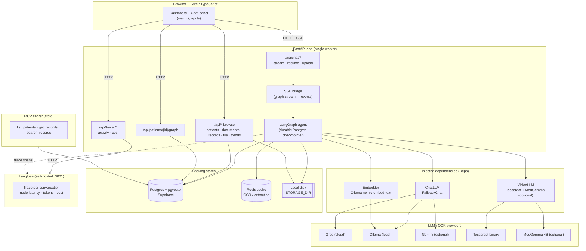
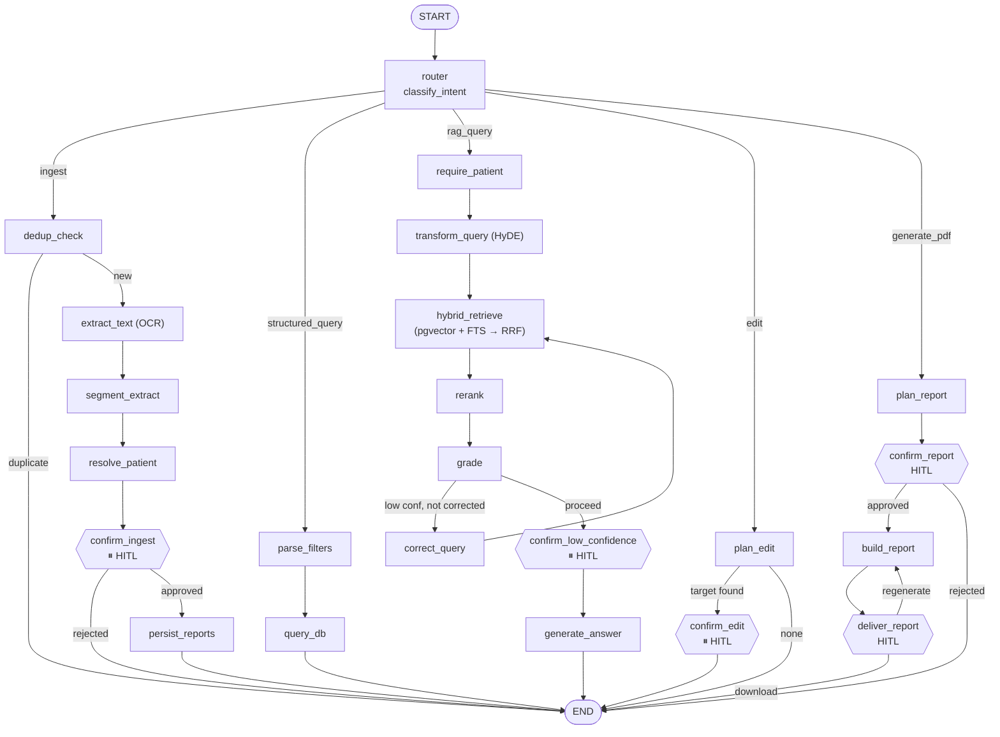
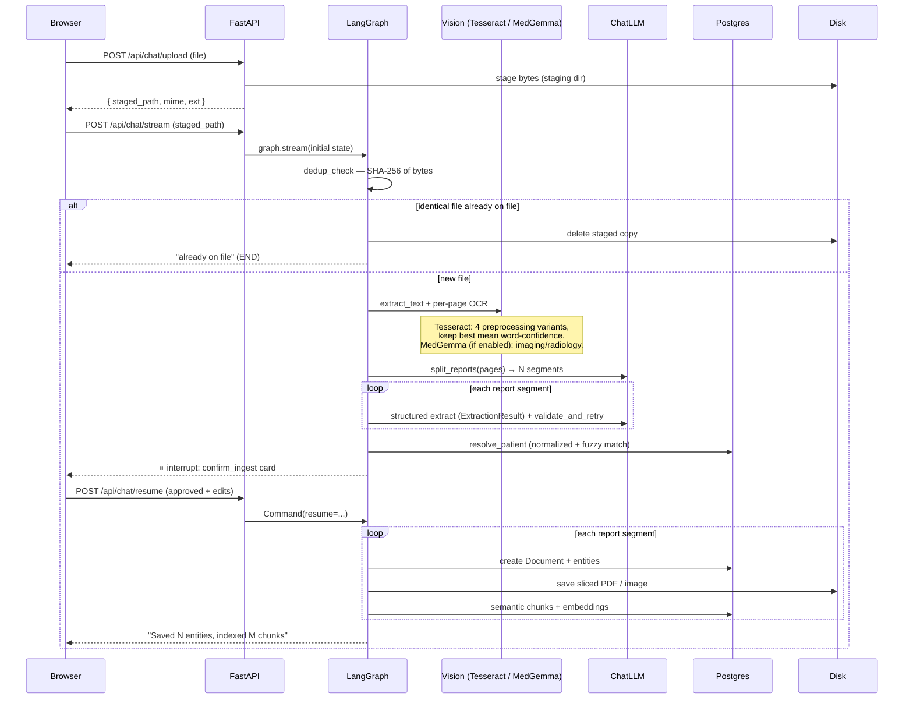
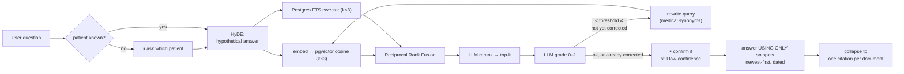
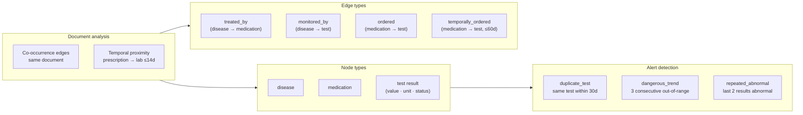
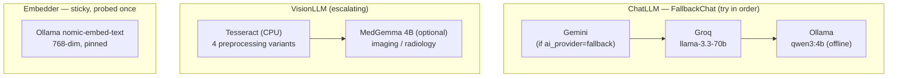
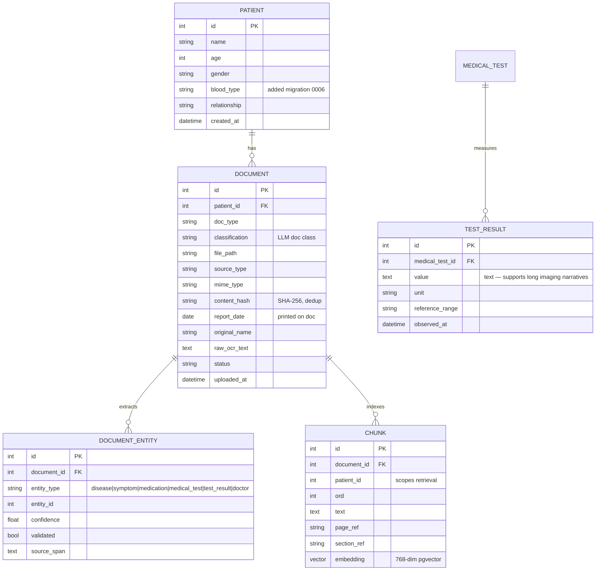

# MedAgentic - Medical Document Intelligence & Tracker

MedAgentic turns messy scanned medical documents into a queryable, patient-centric timeline.
Upload a photo or PDF of a lab report, prescription, or imaging study; the agent
runs OCR, splits multi-report scans, extracts structured medical data, resolves
the patient through a human approval gate, indexes the text for semantic search,
charts clinical trends, generates source-backed answers or PDF summaries, and
renders a live medical relationship graph.

Built on **LangGraph** (stateful agent), **FastAPI** (backend), **Postgres +
pgvector** on Supabase (storage + vector search), **Redis** (cache), and a
polished **Vite/TypeScript** dashboard. Runs on a local machine with CPU-only
OCR, resilient provider fallback, and explicit human-in-the-loop controls for
clinical safety.

**Recruiter quick scan**

- End-to-end AI product: OCR ingestion, LangGraph orchestration, hybrid RAG retrieval,
  human review, data visualization, relationship graph, and PDF report generation.
- Safety-first workflow: no extracted record, edit, weak answer, or generated
  report is accepted blindly; users review and approve sensitive actions.
- Real backend depth: SQLAlchemy models, Alembic migrations (0001–0007), pgvector +
  FTS hybrid search (RRF), Redis caching, SSE streaming, durable Postgres
  checkpointer, deduplication, and a broad pytest suite.
- Product polish: provider-style dashboard, patient cohort navigation, grouped
  clinical records, trend charts, relationship graph with alerts, source document
  links, activity tracer, cost dashboard, and chat-native actions.
- Local-first resilience: Tesseract OCR, MedGemma (optional) imaging, and Ollama
  fallback keep the core system usable even when cloud providers or Redis are unavailable.
- MCP server: exposes patients, records, and hybrid search as tools for Claude
  Desktop, Continue, or any MCP client.

---

## Table of contents

- [Product showcase](#product-showcase)
- [Why it stands out](#why-it-stands-out)
- [Architecture](#architecture)
- [The agent graph](#the-agent-graph)
- [Ingestion pipeline](#ingestion-pipeline)
- [RAG query pipeline](#rag-query-pipeline)
- [PDF report generation](#pdf-report-generation)
- [Medical relationship graph](#medical-relationship-graph)
- [LLM provider strategy](#llm-provider-strategy)
- [Data model](#data-model)
- [Schema migrations](#schema-migrations)
- [Human-in-the-loop](#human-in-the-loop-hitl)
- [MCP server](#mcp-server)
- [Tracing & cost dashboard](#tracing--cost-dashboard)
- [Setup](#setup)
- [Run](#run)
- [API surface](#api-surface)
- [Tests](#tests)
- [Project layout](#project-layout)
- [Operational notes](#operational-notes)

---

## Product showcase

The dashboard is built as a real clinical work surface: patient list on the
left, longitudinal records in the center, and the agentic assistant on the right.


### Human review before persistence

Multi-report uploads are split into dated document cards. The reviewer can fix
the patient name, report title, date, and extracted findings before anything is
saved.


### Duplicate detection

Files are hashed before OCR or LLM work. Re-uploading the same document exits
early and tells the user it was skipped.


### Clinical trends

Extracted test results become chartable data, so a provider can inspect metric
changes across years instead of reading every PDF manually.


### Human-approved PDF generation

The same chat interface can plan a patient-specific report, ask for approval,
and generate a downloadable PDF with matching documents, charts, and attachments.


## Why it stands out

- **Agentic, not just a chat wrapper.** The LangGraph state machine routes
  between ingest, structured browse, hybrid RAG answers, edits, report generation,
  and relationship graph queries.
- **Clinical safety is part of the architecture.** Interrupt nodes pause the
  graph for reviewer decisions instead of burying risk in a prompt.
- **Documents become structured data.** Scans are converted into patients,
  dated documents, entities, test results, semantic chunks, and trendable metrics.
- **Hybrid retrieval.** Semantic pgvector search and Postgres FTS (BM25-ish)
  are fused with reciprocal rank fusion — neither keyword nor vector alone.
- **Medical relationship graph.** Disease–medication–test co-occurrence graph
  with temporal edges, out-of-range status, and alert detection (duplicate tests,
  dangerous trends, repeated abnormals).
- **The UI proves the workflow.** Users can upload, review, browse, chart,
  ask, open source files, delete records, download generated reports, and
  inspect the relationship graph from one dashboard.
- **Failure modes are handled deliberately.** Duplicate files skip expensive
  work, Redis degrades to cache misses, cloud LLMs fall back to local models,
  weak retrieval triggers a confidence gate, and the durable checkpointer falls
  back to in-process memory if the DB is unreachable at boot.

---

## Architecture

Three processes: the browser dashboard, the FastAPI app hosting the LangGraph
agent, and the backing stores. The agent reaches out to LLM providers and an OCR
engine through swappable, dependency-injected clients.



Key boundaries:

- **The agent never talks to a provider directly.** It depends on three Python
  `Protocol`s — `ChatLLM`, `VisionLLM`, `Embedder` — bundled in a `Deps` object
  and injected via the LangGraph config. Tests pass fakes; production passes the
  real fallback wrappers. (`app/agent/state.py`, `app/agent/providers.py`)
- **Durable checkpointer.** The agent uses a `PostgresSaver` (langgraph-checkpoint-postgres)
  so conversation and interrupt state survive restarts. Falls back to in-process
  `MemorySaver` if Postgres is unreachable at boot. Run with exactly one worker.
- **Streaming.** Long-running graph runs stream node-by-node progress to the
  browser over Server-Sent Events; interrupts (HITL gates) are surfaced as events
  the UI renders into approval cards.
- **Vite proxy.** The dev server proxies `/api` to `localhost:8000`, eliminating
  CORS in development without changing backend config.

---

## The agent graph

A single LangGraph state machine handles every request. The router classifies
the incoming turn into one of five intents and dispatches to the matching sub-chain.
All sub-chains share one `AgentState` (`app/agent/state.py`).



`⏸ HITL` nodes call LangGraph `interrupt(...)`. The run halts, the SSE bridge
emits an `interrupt` event, and the run only continues when the client POSTs to
`/api/chat/resume` with the human's decision. (`app/agent/graph.py`)

### Intent routing

| Intent | Trigger | Sub-chain |
|---|---|---|
| `ingest` | file attached (always wins), or LLM classifies it | OCR → segment → extract → resolve patient → confirm → persist |
| `structured_query` | "latest report of Jane", "show prescriptions for Bob" | parse filters → DB query → document chips |
| `rag_query` | content question: "what did the doctor say about her BP?" | HyDE → hybrid retrieve (RRF) → rerank → grade → (CRAG correct) → answer |
| `edit` | "set hemoglobin to 1.2", "correct the report date to 5 Oct 2023" | plan edit → confirm → write |
| `generate_pdf` | "make a PDF of all haematology reports from 2021 to 2024" | plan report → approve → build PDF → download or regenerate |

Routing is LLM-classified (`app/agent/router.py`) except for the hard rule that
a pending file upload is always an ingest.

---

## Ingestion pipeline

A single uploaded scan can contain several dated reports; the pipeline splits it
into one `Document` per report, each with its own date, type, entities, and a
sliced copy of the source PDF.



Notable behaviours:

- **Dedup before OCR.** File is hashed first; identical prior upload
  short-circuits the whole pipeline. (`dedup_check_node`)
- **OCR is escalating and CPU-only.** `TesseractVision` runs up to four
  preprocessing variants (raw, grayscale+contrast+upscale, sharpen, binarize)
  and keeps the result with the highest mean per-word confidence, stopping early
  once it clears 70. No GPU, near-zero RAM. (`app/agent/providers.py`)
- **MedGemma (optional).** When `MEDGEMMA_ENABLED=true`, imaging and radiology
  documents escalate from Tesseract to MedGemma 4B (Ollama-served, local) for
  richer narrative extraction. Off by default.
- **Multi-report split.** `split_reports` asks the LLM to segment pages into
  distinct reports (with a regex fallback); each becomes its own document with
  its own date and entities. The source PDF is sliced per report.
- **Validate-and-retry.** `validate_and_retry` wraps structured extraction:
  if the LLM response is malformed or missing required fields, it retries with
  the schema embedded in the prompt. Provider-independent.
- **Handwriting detection.** Bangla and English handwriting is detected via
  Gemini; prescription pages are no longer dropped on ingest.
- **Caching.** OCR text and structured extraction are cached in Redis keyed by
  content. Redis being down degrades to a no-op.
- **Patient resolution is honorific-aware.** `MRS. NAFISA KABIR` and `Nafisa Kabir`
  normalize to the same person. Exact normalized match auto-resolves; close
  match (difflib ratio ≥ 0.85) becomes a candidate the human confirms.

---

## RAG query pipeline

Content questions run a corrective-RAG (CRAG) loop with HyDE query expansion and
LLM reranking, scoped to a single patient's chunks. Retrieval is hybrid:
pgvector cosine and Postgres FTS fused with Reciprocal Rank Fusion.
(`app/agent/nodes/rag.py`, `app/services/retrieval.py`)



- **Patient-scoped retrieval.** Every chunk carries `patient_id`; search filters
  on it so one patient's records never leak into another's answer.
- **Hybrid RRF.** `_RRF_K = 60` (standard constant). Vector and FTS ranked
  lists are fused: `score = Σ 1/(60 + rank)`. Neither keyword nor vector alone;
  complementary signals combine without tuning a weight.
- **Recency policy.** Snippets ordered newest-first; "What is the RBC?" answers
  with the most recent value and its date.
- **Citations.** Clean prose answer; UI renders a chip per source document
  (name, type, date) that opens the original file.

---

## PDF report generation

Report generation turns a natural-language request into a reviewed export plan.
The agent identifies the patient, filters matching documents by report type and
date range, presents the plan for approval, then builds a downloadable PDF with
clinical records, charts, and source attachments.

The flow mirrors the rest of the safety model:

- **Plan first.** UI shows patient, date range, matching documents, and count.
- **Human approval.** Report only produced after user approves.
- **Auditable output.** Generated reports include selected documents and chart summaries.
- **Delivery gate.** Final step exposes the PDF and supports regeneration.

---

## Medical relationship graph

A force-directed SVG graph (Graph tab) shows how a patient's diseases,
medications, and test results relate. Built from existing DB data — no separate
graph store.



Pipeline (`app/services/graph.py`):

1. **load** — fetch all entities and documents for the patient.
2. **build** — create nodes (disease/medication/test); co-occurrence edges within
   the same document at fixed confidence (treated_by: 0.85, monitored_by: 0.80, ordered: 0.75).
3. **infer_temporal** — link medication in prescription doc → test in lab doc
   within ±60 days (0.85 confidence ≤14d, 0.45 for 15–60d); skip self-referred labs.
4. **annotate** — overlay latest value, unit, and out-of-range status on test nodes.
5. **detect_alerts** — flag duplicate tests, dangerous monotone trends, and
   repeated abnormals.

Rendered as a force-directed SVG with colour-coded node types, hover tooltips,
and an alert badge panel. (`medagentic-dashboard/src/main.ts` Graph tab)

---

## LLM provider strategy

Chat, vision, and embeddings are each resolved independently. Chat uses an
ordered fallback chain; vision is Tesseract CPU-only by default with optional
MedGemma escalation; embeddings are pinned to one provider.



`ai_provider` (env) selects the chat chain:

| `ai_provider` | Chat order |
|---|---|
| `groq` (default) | Groq → Ollama |
| `ollama` | Ollama only (fully offline) |
| `fallback` | Gemini → Groq → Ollama |

Two extraction modes in `app/agent/llm.py`:

| Mode | Model | When used |
|---|---|---|
| `json_object` | `llama-3.3-70b-versatile` | default; schema in prompt, manually parsed |
| `json_schema` (strict) | `gpt-oss-120b` (`GROQ_STRUCTURED_MODEL`) | `feat/constrained-decoding`; Groq strict-schema mode with a sanitizer that drops unsupported keys before submission |

`json_object` is the default because `json_schema` strict mode on Groq truncated
long arrays (1 of 25 tests). `json_schema` is the upgrade path for precise schema
conformance when the model supports it without truncation.

---

## Data model



`DOCUMENT_ENTITY` is a polymorphic link: extracted diseases, symptoms,
medications, tests, and test results are stored in their own tables
(deduplicated by name) and linked to the document they came from, with the
confidence and the source text span that justified the extraction.

`CHUNK` carries `page_ref` and `section_ref` for fine-grained citation and
is indexed by both a 768-dim pgvector column and a GIN FTS index
(`ix_chunk_text_fts`) for hybrid retrieval.

Schema managed by Alembic (`migrations/versions/`).

---

## Schema migrations

| ID | Description |
|---|---|
| `0001` | Initial schema — all tables, pgvector extension, indexes |
| `0002` | `document.content_hash` (SHA-256 dedup) |
| `0003` | `document.report_date` (date on printed document) |
| `0004` | `document.original_name` (uploaded filename for display) |
| `0005` | `test_result.value` widened from VARCHAR(120) to TEXT (imaging narratives) |
| `0006` | `patient.blood_type` VARCHAR(8) nullable |
| `0007` | GIN FTS index `ix_chunk_text_fts` on `chunk.text` (hybrid retrieval BM25 half) |

Run: `alembic upgrade head`

---

## Human-in-the-loop (HITL)

Five points pause the graph for a human decision. Each is a LangGraph
`interrupt(...)`; the run resumes via `/api/chat/resume`.

| Gate | Node | The human decides |
|---|---|---|
| Ingest review | `confirm_ingest` | approve/reject; edit each report's patient, type, date, and entities; resolve patient ambiguity |
| Edit verify | `confirm_edit` | approve a current→proposed value change before any DB write |
| Low-confidence answer | `confirm_low_confidence` | whether to answer from weak retrieval, or decline |
| Report plan | `confirm_report` | approve/cancel/modify a PDF export plan before generation |
| Report delivery | `deliver_report` | download the finished PDF or regenerate it |

No document is persisted, no extracted value is changed, and no shaky answer is
emitted without explicit human approval.

---

## MCP server

`app/mcp/server.py` exposes three read-only tools via stdio transport:

| Tool | Description |
|---|---|
| `list_patients` | All patients with id, name, age, gender, blood type |
| `get_records` | Structured records (diseases, symptoms, meds, test results) for a patient |
| `search_records(patient_id, query, k)` | Hybrid semantic+keyword search over a patient's chunks |

Run: `python -m app.mcp.server` (stdio) or `mcp run app/mcp/server.py`.

Ingest is intentionally not an MCP tool — the HITL patient-resolution gate
requires interactive approval and cannot be driven headlessly without losing the
safety check.

---

## Tracing & cost dashboard

Per-conversation traces (node latency + LLM model/tokens/cost), fully local via
self-hosted Langfuse.

The **Activity tab** in the tracer panel shows every conversation with kind
(upload vs. question), duration, speed label, and token count pulled from
Langfuse `/api/public/traces`.

The **Cost tab** aggregates per-model token usage and USD cost (Groq/Ollama = $0,
Gemini 2.5 Flash = $0.075/$0.30 per 1M tokens) from Langfuse observations.

Setup:

1. `make dev` starts the Langfuse stack automatically (or `make tracing` alone).
2. Open http://localhost:3001, create an account + project.
3. Copy the project's public/secret keys into `.env`:
   ```
   LANGFUSE_PUBLIC_KEY=pk-...
   LANGFUSE_SECRET_KEY=sk-...
   LANGFUSE_HOST=http://localhost:3001
   ```
4. Restart the app. Traces appear per conversation (grouped by thread/session).

Tracing is OFF when the keys are blank. **Keep `LANGFUSE_HOST` local — never
`cloud.langfuse.com`; traces contain medical content.**

Port layout: `5173` = Vite dev frontend, `3001` = Langfuse UI, `8000` = backend API.

---

## Setup

1. `python -m venv .venv && source .venv/bin/activate`
2. `pip install -r requirements.txt`
3. Install Tesseract: `sudo apt install tesseract-ocr`
4. (Local LLM/embeddings) install [Ollama](https://ollama.com) and pull:
   `ollama pull qwen3:4b && ollama pull nomic-embed-text`
5. (Optional imaging OCR) pull MedGemma: `ollama pull medgemma` and set `MEDGEMMA_ENABLED=true`
6. (Optional cache) run Redis: `docker run -p 6379:6379 redis`
7. Copy `.env.example` to `.env`; set `DATABASE_URL` to your Supabase **session
   pooler** URL (IPv4):
   `postgresql+psycopg://postgres.<ref>:<pw>@aws-1-<region>.pooler.supabase.com:5432/postgres`
   Set `GROQ_API_KEY` for the fast cloud path. Set `TEST_DATABASE_URL` to a
   **separate** throwaway DB — never the same as `DATABASE_URL` (see [Tests](#tests)).
8. `python -m alembic upgrade head`

Key environment variables (`app/config.py`):

| Var | Default | Purpose |
|---|---|---|
| `DATABASE_URL` | — | Supabase Postgres (session pooler, IPv4) |
| `AI_PROVIDER` | `groq` | chat chain: `groq` / `ollama` / `fallback` |
| `GROQ_API_KEY` | — | Groq cloud chat |
| `GROQ_MODEL` | `llama-3.3-70b-versatile` | Groq chat model |
| `OLLAMA_HOST` | `http://localhost:11434` | local LLM/embeddings |
| `OLLAMA_MODEL` | `qwen3:4b` | offline chat fallback |
| `OLLAMA_EMBED_MODEL` | `nomic-embed-text` | embeddings (768-dim, pinned) |
| `MEDGEMMA_ENABLED` | `false` | enable MedGemma 4B for imaging OCR |
| `MEDGEMMA_MODEL` | `medgemma` | Ollama model name for MedGemma |
| `REDIS_URL` | `redis://localhost:6379/0` | cache (optional) |
| `STORAGE_DIR` | `./data/files` | raw file storage (absolute path) |
| `RAG_TOP_K` | `5` | retrieved chunks per answer |
| `RAG_CONFIDENCE_THRESHOLD` | `0.5` | grade below this triggers CRAG / HITL |
| `LANGFUSE_PUBLIC_KEY` | — | Langfuse tracing (optional) |
| `LANGFUSE_SECRET_KEY` | — | Langfuse tracing (optional) |
| `LANGFUSE_HOST` | `http://localhost:3001` | Langfuse endpoint (keep local) |

---

## Run

`make` targets wrap the commands:

    make run      # backend  (FastAPI :8000, single worker)
    make ui       # frontend (Vite :5173)
    make dev      # both + Langfuse tracing stack (backend backgrounded)
    make tracing  # Langfuse stack only

Raw equivalents — backend must be **one worker** (durable checkpointer is in-process
until Postgres handshake; even after, the MemorySaver fallback is in-process):

    .venv/bin/python3 -m uvicorn app.api.server:app --port 8000 --workers 1

    cd medagentic-dashboard
    npm install
    npm run dev   # proxies /api → localhost:8000 (no CORS config needed)

Frontend typecheck: `cd medagentic-dashboard && npx tsc --noEmit`.

---

## API surface

Chat / agent (`app/api/routes_chat.py`):

| Method | Path | Purpose |
|---|---|---|
| `POST` | `/api/chat/upload` | stage a file, returns `staged_path` |
| `POST` | `/api/chat/stream` | run the agent; **SSE** stream of `progress` / `node` / `interrupt` / `message` / `done` events |
| `POST` | `/api/chat/resume` | resume an interrupted run with the human decision |

Browse / records (`app/api/routes_browse.py`):

| Method | Path | Purpose |
|---|---|---|
| `GET` | `/api/health` | service + DB health |
| `GET` / `POST` | `/api/patients` | list / create patients |
| `GET` | `/api/patients/{id}/records` | merged disease/symptom/med/test records |
| `GET` | `/api/patients/{id}/documents` | document timeline |
| `GET` | `/api/patients/{id}/trends` | trendable metric list |
| `GET` | `/api/patients/{id}/trends/{key}` | time-series data for one metric |
| `GET` | `/api/documents/{id}/file` | stream the original uploaded file |
| `POST` | `/api/patients/{id}/records/delete` | delete documents |

Graph (`app/api/routes_graph.py`):

| Method | Path | Purpose |
|---|---|---|
| `GET` | `/api/patients/{id}/graph` | medical relationship graph (nodes + edges + alerts) |

Tracer (`app/api/routes_tracer.py`):

| Method | Path | Purpose |
|---|---|---|
| `GET` | `/api/tracer/activity` | recent conversations from Langfuse (or disabled stub) |
| `GET` | `/api/tracer/cost` | per-model token usage + USD cost |

---

## Tests

    pytest -v

DB tests exercise real Postgres/pgvector (not mocked); agent tests inject fake
LLM/embedder clients and run offline.

> **WARNING — the test DB must NOT be the prod DB.** Autouse fixtures delete rows;
> pointing tests at `DATABASE_URL` wipes real patient data. `TEST_DATABASE_URL`
> must be a **separate throwaway database** — `tests/conftest.py` refuses to run
> (raises at collection) when it is empty or equal to `DATABASE_URL`. Cleanup
> removes only test-created patients (snapshot diff), never pre-existing data.
>
> `app/db.py` and `migrations/env.py` use `DATABASE_URL` only — they never read
> `TEST_DATABASE_URL`. The test suite overrides the engine via its own fixture.

---

## Project layout

```
app/
  agent/
    graph.py          LangGraph wiring (nodes + edges)
    router.py         intent classification
    state.py          AgentState, extraction schemas, Deps + client Protocols
    llm.py            Groq chat/vision clients
    providers.py      Tesseract OCR, MedGemma, Ollama, Gemini, fallback wrappers
    embeddings.py     Ollama embedder
    checkpointer.py   durable PostgresSaver factory (fallback to MemorySaver)
    tracing.py        Langfuse handler factory
    nodes/
      ingest.py       OCR → segment → extract → resolve → confirm → persist
      rag.py          HyDE → hybrid retrieve (RRF) → rerank → grade → CRAG → answer
      structured.py   filter parsing + DB document lookup
      edit.py         plan + HITL-verified record edits
  api/
    server.py         FastAPI app + CORS
    routes_chat.py    upload / stream / resume
    routes_browse.py  patients / documents / records / file / trends
    routes_graph.py   medical relationship graph
    routes_tracer.py  Langfuse activity + cost proxy
    sse.py            graph.stream → Server-Sent Events bridge
    runtime.py        compiled-graph + Deps singletons, node labels
    mapping.py        DB rows → API response shapes
  services/           extraction, segment, chunking, retrieval (hybrid RRF),
                      entities, patients, documents, dates, edits, dedup,
                      purge, health, trends, graph, browse
  mcp/
    server.py         MCP stdio server (list_patients · get_records · search_records)
  models.py           SQLAlchemy ORM
  config.py           pydantic-settings env config
  cache.py            Redis get-or-set (degrades to no-op)
  storage.py          local-disk file storage
migrations/
  versions/
    0001_initial.py
    0002_document_content_hash.py
    0003_document_report_date.py
    0004_document_original_name.py
    0005_test_result_value_text.py
    0006_patient_blood_type.py
    0007_chunk_text_fts_index.py
medagentic-dashboard/ Vite + TypeScript frontend
  src/
    main.ts           dashboard UI — tabs: Records, Trends, Graph, Activity, Cost
    api.ts            typed fetch wrappers (proxied via Vite /api)
    types.ts          shared TypeScript interfaces
tests/                pytest suite (services + agent nodes + API)
docs/
  PRD-medical-relationship-graph.md
```

---

## Operational notes

- **Single worker only.** Even with the durable `PostgresSaver`, run one Uvicorn
  worker. The fallback `MemorySaver` is in-process; the SSE bridge holds a live
  generator per thread.
- **IPv4 / Supabase.** Direct Supabase connections are IPv6-only; use the session
  pooler URL for IPv4 networks and tooling (Alembic, local runs).
- **File storage.** Raw files live on local disk under `STORAGE_DIR` (absolute
  path); the DB stores the path + original filename. Multi-report PDFs are sliced
  per report. Serve via `GET /api/documents/{id}/file`.
- **Vite proxy.** `medagentic-dashboard/vite.config.ts` proxies `/api` to
  `http://localhost:8000`. The API base in `api.ts` defaults to `''` (same
  origin). No CORS config needed in dev; set `VITE_API_BASE` only for remote backends.
- **Graceful degradation everywhere.** Redis down → caching off. Provider failing
  → fall to the next in chain. Bad OCR variant → skipped, best kept. HyDE
  failing → fall back to raw query. Durable checkpointer unreachable → MemorySaver.
- **Tracing is opt-in.** Leave `LANGFUSE_PUBLIC_KEY` blank to disable entirely.
  Never point `LANGFUSE_HOST` at `cloud.langfuse.com` — traces contain medical content.

## Evaluation harness

`feat/constrained-decoding` adds a golden-set extraction eval (`app/eval/`):

- Fixed golden set of test documents with expected extraction output.
- `GOLDEN_SET` env var overrides the path for private/sensitive records.
- Scores per-field accuracy (scalar values, name-value pairs, entity lists).
- Run: `python -m app.eval` — no fixtures, no frameworks, stdout report.

Separate from the pytest suite; targets extraction quality, not API correctness.

---

## UI variants

The `fix/UI` branch (not yet merged) ships an alternative frontend skin:

- **Glass theme** — frosted-glass cards, muted palette, soothing shadows.
- **Minimalist record tables** — denser layout, less chrome.
- **Loading spinners** on async fetches.
- **Multi-report segment fixes** — deduplicates page indices when the LLM names
  reports but omits page numbers; warns when a multi-report slice retains all
  pages (no split detected).

Current `master`/`feat/graph` uses the original dashboard theme.

---

## Design docs

Specs and plans under `.claude/specs/`, `.claude/plans/`, and `docs/superpowers/`.
Start with `.claude/specs/2026-06-16-agentic-chatbot-design.md` for the agent
design and `.claude/specs/2026-06-15-medical-doc-intelligence-design.md` for the
foundation.
