# MedAgentic - Medical Document Intelligence & Tracker

MedAgentic is a production-minded, agentic healthcare records system that turns
messy scanned medical documents into a queryable, patient-centric timeline.
Upload a photo or PDF of a lab report, prescription, or imaging study; the agent
runs OCR, splits multi-report scans, extracts structured medical data, resolves
the patient through a human approval gate, indexes the text for semantic search,
charts clinical trends, and generates source-backed answers or PDF summaries.

Built on **LangGraph** (stateful agent), **FastAPI** (backend), **Postgres +
pgvector** on Supabase (storage + vector search), **Redis** (cache), and a
polished **Vite/TypeScript** dashboard. It is designed to run on a local machine
with CPU-only OCR, resilient provider fallback, and explicit human-in-the-loop
controls for clinical safety.

**Recruiter quick scan**

- End-to-end AI product: OCR ingestion, LangGraph orchestration, RAG retrieval,
  human review, data visualization, and PDF report generation.
- Safety-first workflow: no extracted record, edit, weak answer, or generated
  report is accepted blindly; users review and approve sensitive actions.
- Real backend depth: SQLAlchemy models, Alembic migrations, pgvector search,
  Redis caching, SSE streaming, deduplication, and a broad pytest suite.
- Product polish: provider-style dashboard, patient cohort navigation, grouped
  clinical records, trend charts, source document links, and chat-native actions.
- Local-first resilience: Tesseract OCR and Ollama fallback keep the core system
  usable even when cloud providers or Redis are unavailable.

---

## Table of contents

- [Product showcase](#product-showcase)
- [Why it stands out](#why-it-stands-out)
- [Architecture](#architecture)
- [The agent graph](#the-agent-graph)
- [Ingestion pipeline](#ingestion-pipeline)
- [RAG query pipeline](#rag-query-pipeline)
- [PDF report generation](#pdf-report-generation)
- [LLM provider strategy](#llm-provider-strategy)
- [Data model](#data-model)
- [Human-in-the-loop](#human-in-the-loop-hitl)
- [Setup](#setup)
- [Run](#run)
- [API surface](#api-surface)
- [Tests](#tests)
- [Project layout](#project-layout)
- [Operational notes](#operational-notes)

---

## Product showcase

The dashboard is built as a real clinical work surface: patient list on the
left, longitudinal records in the center, and the agentic assistant on the right.

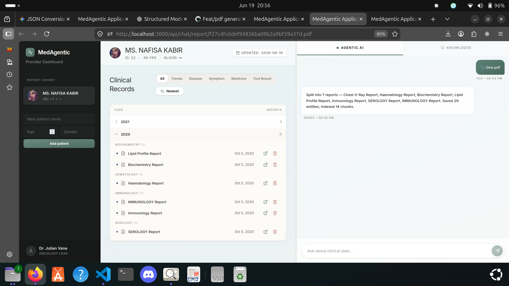

### Human review before persistence

Multi-report uploads are split into dated document cards. The reviewer can fix
the patient name, report title, date, and extracted findings before anything is
saved.

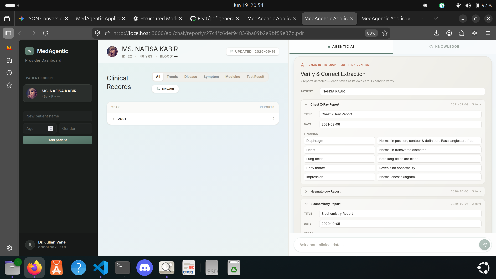

### Duplicate detection

Files are hashed before OCR or LLM work. Re-uploading the same document exits
early and tells the user it was skipped.

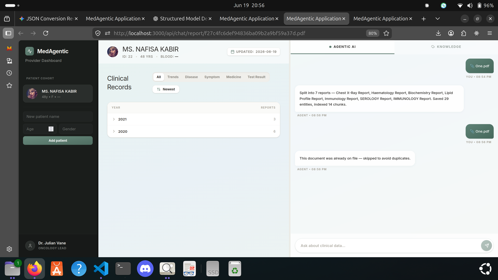

### Clinical trends

Extracted test results become chartable data, so a provider can inspect metric
changes across years instead of reading every PDF manually.

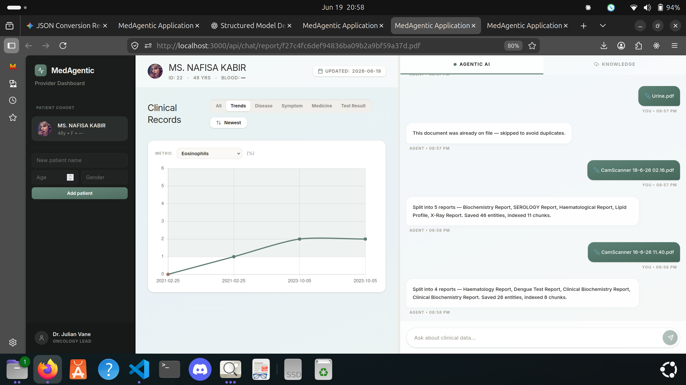

### Human-approved PDF generation

The same chat interface can plan a patient-specific report, ask for approval,
and generate a downloadable PDF with matching documents, charts, and
attachments.

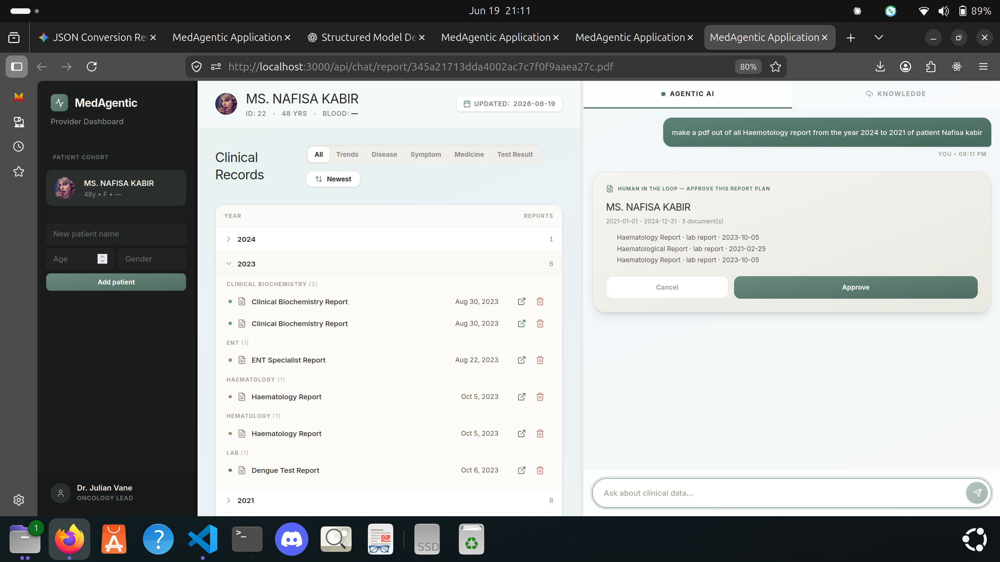

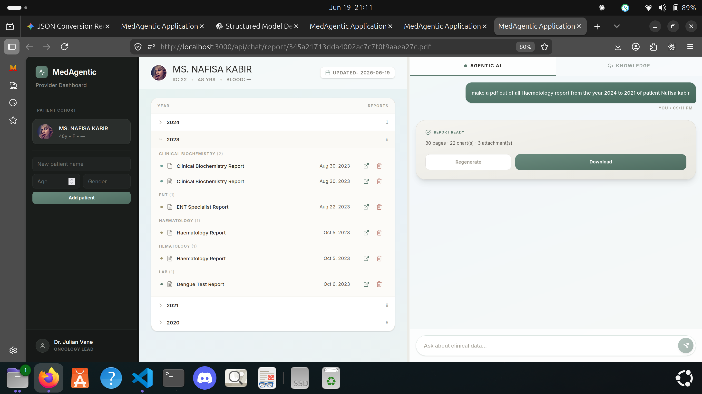

## Why it stands out

- **Agentic, not just a chat wrapper.** The LangGraph state machine routes
  between ingest, structured browse, RAG answers, edits, and report generation.
- **Clinical safety is part of the architecture.** Interrupt nodes pause the
  graph for reviewer decisions instead of burying risk in a prompt.
- **Documents become structured data.** Scans are converted into patients,
  dated documents, entities, test results, semantic chunks, and trendable
  metrics.
- **The UI proves the workflow.** Users can upload, review, browse, chart, ask,
  open source files, delete records, and download generated reports from one
  dashboard.
- **Failure modes are handled deliberately.** Duplicate files skip expensive
  work, Redis degrades to cache misses, cloud LLMs fall back to local models,
  and weak retrieval triggers a confidence gate.

---

## Architecture

Three processes: the browser dashboard, the FastAPI app hosting the LangGraph
agent, and the backing stores. The agent reaches out to LLM providers and an OCR
engine through swappable, dependency-injected clients.

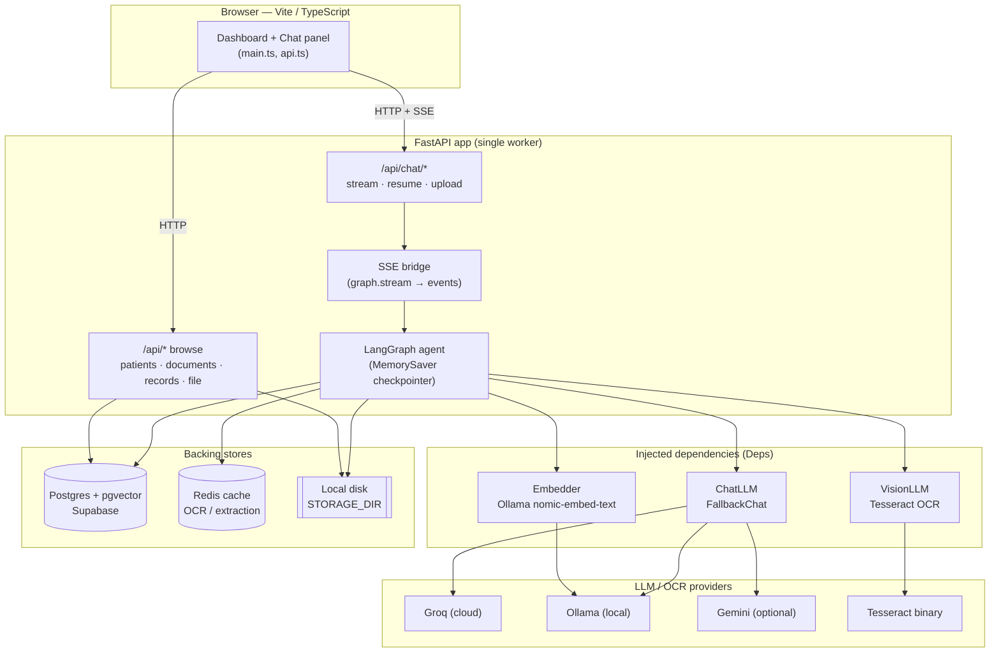

Key boundaries:

- **The agent never talks to a provider directly.** It depends on three Python
  `Protocol`s — `ChatLLM`, `VisionLLM`, `Embedder` — bundled in a `Deps` object
  and injected via the LangGraph config. Tests pass fakes; production passes the
  real fallback wrappers. (`app/agent/state.py`, `app/agent/providers.py`)
- **Single worker, in-process checkpointer.** The agent uses LangGraph's
  `MemorySaver`, so conversation/interrupt state lives in process memory. Run the
  API with exactly one worker or threads will not see each other's state.
- **Streaming.** Long-running graph runs stream node-by-node progress to the
  browser over Server-Sent Events; interrupts (HITL gates) are surfaced as events
  the UI renders into approval cards.

---

## The agent graph

A single LangGraph state machine handles every request. The router classifies the
incoming turn into one of four intents and dispatches to the matching sub-chain.
All sub-chains share one `AgentState` (`app/agent/state.py`).

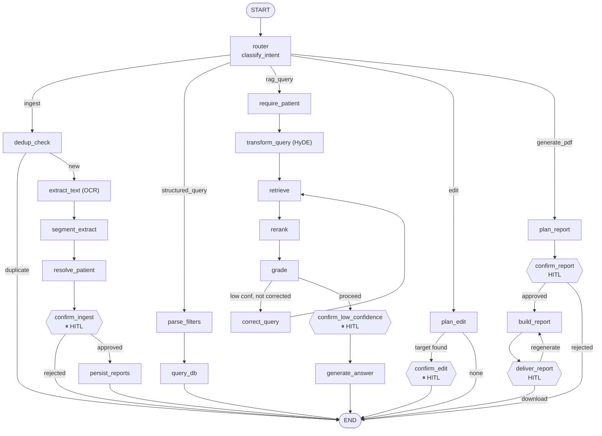

`⏸ HITL` nodes call LangGraph `interrupt(...)`. The run halts, the SSE bridge
emits an `interrupt` event, and the run only continues when the client POSTs to
`/api/chat/resume` with the human's decision. (`app/agent/graph.py`)

### Intent routing

| Intent | Trigger | Sub-chain |
|---|---|---|
| `ingest` | a file is attached (always wins), or the LLM classifies it so | OCR -> segment -> extract -> resolve patient -> confirm -> persist |
| `structured_query` | "latest report of Jane", "show prescriptions for Bob" | parse filters -> DB query -> document chips |
| `rag_query` | a content question: "what did the doctor say about her BP?" | HyDE -> retrieve -> rerank -> grade -> (CRAG correct) -> answer |
| `edit` | "set hemoglobin to 1.2", "correct the report date to 5 Oct 2023" | plan edit -> confirm -> write |
| `generate_pdf` | "make a PDF of all haematology reports from 2021 to 2024" | plan report -> approve -> build PDF -> download or regenerate |

Routing is LLM-classified (`app/agent/router.py`) except for the hard rule that a
pending file upload is always an ingest.

---

## Ingestion pipeline

The most involved path. A single uploaded scan can contain several dated reports;
the pipeline splits it into one `Document` per report, each with its own date,
type, entities, and a sliced copy of the source PDF.

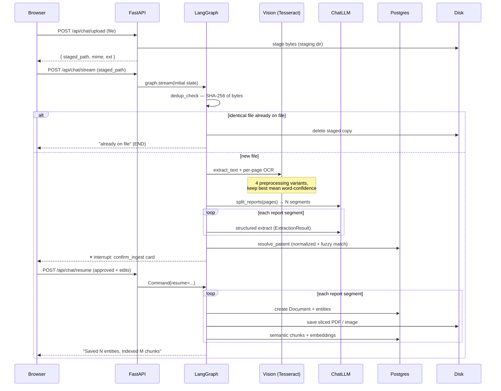

Notable behaviours:

- **Dedup before OCR.** The file is hashed first; an identical prior upload
  short-circuits the whole pipeline (no OCR, no LLM, no HITL). (`dedup_check_node`)
- **OCR is escalating and CPU-only.** `TesseractVision` runs up to four
  preprocessing variants (raw, grayscale+contrast+upscale, sharpen, binarize) and
  keeps the result with the highest mean per-word confidence, stopping early once
  it clears a benchmark of 70. No GPU, near-zero RAM. (`app/agent/providers.py`)
- **Multi-report split.** `split_reports` asks the LLM to segment the pages into
  distinct reports (with a regex fallback); each becomes its own document with its
  own report date and entities. The source PDF is sliced per report so each
  document card opens just that report.
- **Caching.** OCR text and structured extraction are cached in Redis keyed by
  content, so re-ingesting or retrying skips the expensive calls. Redis being
  down degrades to a no-op (cache miss runs the real function).
- **Patient resolution is honorific-aware.** `MRS. NAFISA KABIR` and
  `Nafisa Kabir` normalize to the same person. An exact normalized match
  auto-resolves; a close-but-not-exact match (difflib ratio ≥ 0.85) or an
  ambiguous tie becomes a candidate the human confirms — never a silent duplicate
  profile.

---

## RAG query pipeline

Content questions run a corrective-RAG (CRAG) loop with HyDE query expansion and
LLM reranking, scoped to a single patient's chunks. (`app/agent/nodes/rag.py`)

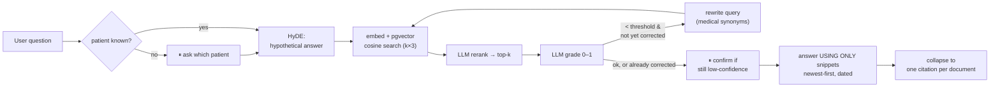

- **Patient-scoped retrieval.** Every chunk carries `patient_id`; search filters
  on it so one patient's records never leak into another's answer.
  (`app/services/retrieval.py`)
- **Recency policy.** Snippets are tagged with their report date and ordered
  newest-first. "What is the RBC?" answers with the most recent value and its
  date; older or multiple values appear only when the question asks about a date,
  period, or trend.
- **Citations.** The answer is clean prose; the UI renders a chip per source
  document (name, type, date) that opens the original file — never raw chunk ids.

---

## PDF report generation

Report generation turns a natural-language request into a reviewed export plan.
The agent identifies the patient, filters matching documents by report type and
date range, presents the plan for approval, then builds a downloadable PDF with
the selected clinical records, charts, and source attachments. After generation,
the delivery card shows the page, chart, and attachment counts and lets the user
download or regenerate the report.

The flow mirrors the rest of the safety model:

- **Plan first.** The UI shows the patient, date range, matching documents, and
  document count before generation.
- **Human approval.** The report is only produced after the user approves the
  plan.
- **Auditable output.** Generated reports keep source context by including the
  selected documents and chart summaries.
- **Delivery gate.** The final step exposes the generated PDF and supports
  regeneration without restarting the request.

---

## LLM provider strategy

Chat, vision, and embeddings are each resolved independently. Chat uses an
ordered fallback chain; vision is CPU-only Tesseract; embeddings are pinned to one
provider (mixing embedding models would corrupt the shared 768-dim vector space).

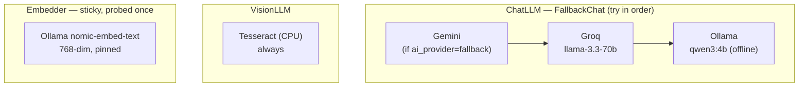

`ai_provider` (env) selects the chat chain:

| `ai_provider` | Chat order |
|---|---|
| `groq` (default) | Groq → Ollama |
| `ollama` | Ollama only (fully offline) |
| `fallback` | Gemini → Groq → Ollama |

Structured extraction on Groq uses raw `json_object` response format with the
schema embedded in the prompt and parsed manually — function/tool binding on Groq
llama truncated long arrays (1 of 25 tests), whereas JSON mode returns every item
in a few seconds. (`app/agent/llm.py`)

---

## Data model

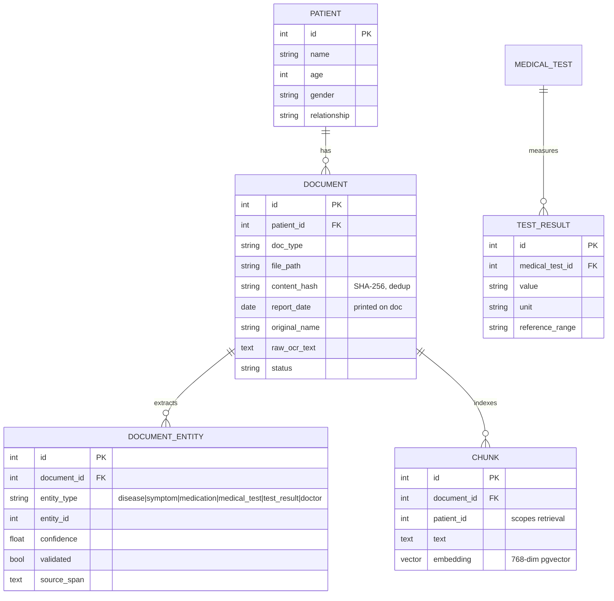

`DOCUMENT_ENTITY` is a polymorphic link: extracted diseases, symptoms,
medications, tests, and test results are stored in their own tables (deduplicated
by name) and linked to the document they came from, with the confidence and the
source text span that justified the extraction. Schema is managed by Alembic
(`migrations/versions/`).

---

## Human-in-the-loop (HITL)

Five points pause the graph for a human decision. Each is a LangGraph
`interrupt(...)`; the run resumes via `/api/chat/resume`.

| Gate | Node | The human decides |
|---|---|---|
| Ingest review | `confirm_ingest` | approve/reject; edit each report's patient, type, date, and entities; resolve patient ambiguity |
| Edit verify | `confirm_edit` | approve a current->proposed value change before any DB write |
| Low-confidence answer | `confirm_low_confidence` | whether to answer from weak retrieval, or decline |
| Report plan | `confirm_report` | approve/cancel/modify a PDF export plan before generation |
| Report delivery | `deliver_report` | download the finished PDF or regenerate it |

No document is persisted, no extracted value is changed, and no shaky answer is
emitted without explicit human approval. Report exports follow the same pattern:
the user sees the selected records before the PDF is generated.

---

## Setup

1. `python -m venv .venv && source .venv/bin/activate`
2. `pip install -r requirements.txt`
3. Install the Tesseract binary (CPU OCR): `sudo apt install tesseract-ocr`
4. (Local LLM/embeddings) install [Ollama](https://ollama.com) and pull the
   models: `ollama pull qwen3:4b && ollama pull nomic-embed-text`
5. (Optional cache) run Redis: `docker run -p 6379:6379 redis` — the app works
   without it, just without caching.
6. Copy `.env.example` to `.env`; set `DATABASE_URL` to your Supabase **session
   pooler** URL (IPv4):
   `postgresql+psycopg://postgres.<ref>:<pw>@aws-1-<region>.pooler.supabase.com:5432/postgres`
   New projects use the `aws-1-<region>` host, not `aws-0`. Set `GROQ_API_KEY` for
   the fast cloud path. Set `TEST_DATABASE_URL` to a **separate** throwaway DB —
   never the same as `DATABASE_URL` (see [Tests](#tests)).
7. `alembic upgrade head`

Key environment variables (`app/config.py`):

| Var | Default | Purpose |
|---|---|---|
| `DATABASE_URL` | — | Supabase Postgres (session pooler, IPv4) |
| `AI_PROVIDER` | `groq` | chat chain: `groq` / `ollama` / `fallback` |
| `GROQ_API_KEY` | — | Groq cloud chat |
| `GROQ_MODEL` | `llama-3.3-70b-versatile` | Groq chat model |
| `OLLAMA_HOST` | `http://localhost:11434` | local LLM/embeddings |
| `OLLAMA_MODEL` | `qwen3:4b` | offline chat fallback |
| `OLLAMA_EMBED_MODEL` | `nomic-embed-text` | embeddings (768-dim, pinned) |
| `REDIS_URL` | `redis://localhost:6379/0` | cache (optional) |
| `STORAGE_DIR` | `./data/files` | raw file storage (absolute path) |
| `RAG_TOP_K` | `5` | retrieved chunks per answer |
| `RAG_CONFIDENCE_THRESHOLD` | `0.5` | grade below this triggers CRAG / HITL |

---

## Run

`make` targets wrap the commands:

    make run    # backend  (FastAPI :8000, single worker)
    make ui     # frontend (Vite :3000)
    make dev    # both (backend backgrounded; Ctrl-C stops UI)

Raw equivalents — backend must be a **single worker** (the agent checkpointer is
in-process memory):

    uvicorn app.api.server:app --port 8000 --workers 1

    cd medagentic-dashboard
    npm install
    npm run dev

Set `VITE_API_BASE` in `medagentic-dashboard/.env` if the API is not on
`http://localhost:8000`. Frontend typecheck: `cd medagentic-dashboard && npx tsc --noEmit`.

---

## API surface

Chat / agent (`app/api/routes_chat.py`):

| Method | Path | Purpose |
|---|---|---|
| `POST` | `/api/chat/upload` | stage a file, returns `staged_path` |
| `POST` | `/api/chat/stream` | run the agent; **SSE** stream of `progress` / `node` / `interrupt` / `message` / `done` events |
| `POST` | `/api/chat/resume` | resume an interrupted run with the human decision |

Browse / records (`app/api/routes_browse.py`):

| Method | Path | Purpose |
|---|---|---|
| `GET` | `/api/health` | service + DB health |
| `GET` / `POST` | `/api/patients` | list / create patients |
| `GET` | `/api/patients/{id}/records` | merged disease/symptom/med/test records |
| `GET` | `/api/patients/{id}/documents` | document timeline |
| `GET` | `/api/documents/{id}/file` | stream the original uploaded file |
| `POST` | `/api/patients/{id}/records/delete` | delete documents |

---

## Tests

    pytest -v

DB tests exercise the real Postgres/pgvector (not mocked); agent tests inject fake
LLM/embedder clients so they run offline and fast.

> **WARNING — the test DB must NOT be the prod DB.** Autouse fixtures delete rows;
> pointing tests at `DATABASE_URL` wipes real patient data. `TEST_DATABASE_URL`
> must be a **separate throwaway database** — `tests/conftest.py` refuses to run
> (raises at collection) when it is empty or equal to `DATABASE_URL`. Cleanup
> removes only test-created patients (snapshot diff), never pre-existing data.

---

## Project layout

```
app/
  agent/
    graph.py          LangGraph wiring (nodes + edges)
    router.py         intent classification
    state.py          AgentState, extraction schemas, Deps + client Protocols
    llm.py            Groq chat/vision clients
    providers.py      Tesseract OCR, Ollama, Gemini, fallback wrappers
    embeddings.py     Ollama embedder
    nodes/
      ingest.py       OCR → segment → extract → resolve → confirm → persist
      rag.py          HyDE → retrieve → rerank → grade → CRAG → answer
      structured.py   filter parsing + DB document lookup
      edit.py         plan + HITL-verified record edits
  api/
    server.py         FastAPI app + CORS
    routes_chat.py    upload / stream / resume
    routes_browse.py  patients / documents / records / file
    sse.py            graph.stream → Server-Sent Events bridge
    runtime.py        compiled-graph + Deps singletons, node labels
  services/           extraction, segment, chunking, retrieval, entities,
                      patients, documents, dates, edits, dedup, purge, health
  models.py           SQLAlchemy ORM
  config.py           pydantic-settings env config
  cache.py            Redis get-or-set (degrades to no-op)
  storage.py          local-disk file storage
migrations/           Alembic schema migrations
medagentic-dashboard/ Vite + TypeScript frontend (main.ts, api.ts, types.ts)
tests/                pytest suite (services + agent nodes + API)
```

---

## Operational notes

- **Single worker only.** The LangGraph `MemorySaver` checkpointer is in-process;
  multiple workers would not share conversation/interrupt state.
- **IPv4 / Supabase.** Direct Supabase connections are IPv6-only; use the session
  pooler URL for IPv4 networks and tooling (Alembic, local runs).
- **File storage.** Raw files live on local disk under `STORAGE_DIR` (absolute
  path); the DB stores the path + original filename. Multi-report PDFs are sliced
  per report. Serve via `GET /api/documents/{id}/file`.
- **Graceful degradation everywhere.** Redis down → caching off, not failure.
  A provider failing → fall to the next in the chain. A bad OCR variant → skipped,
  best of the rest kept. HyDE failing → fall back to the raw query.

## Design docs

Specs and plans live under `.claude/specs/`, `.claude/plans/`, and
`docs/superpowers/`. Start with
`.claude/specs/2026-06-16-agentic-chatbot-design.md` for the agent design and
`.claude/specs/2026-06-15-medical-doc-intelligence-design.md` for the foundation.

## Tracing (optional, self-hosted Langfuse)

Per-conversation traces (node latency + LLM model/tokens), fully local.

1. `docker compose -f docker-compose.langfuse.yml up -d`
2. Open http://localhost:3000, create an account + project.
3. Copy the project's public/secret keys into `.env`:
   ```
   LANGFUSE_PUBLIC_KEY=pk-...
   LANGFUSE_SECRET_KEY=sk-...
   LANGFUSE_HOST=http://localhost:3000
   ```
4. Restart the app. Traces appear per conversation (grouped by thread/session).

Tracing is OFF when the keys are blank. **Keep `LANGFUSE_HOST` local — never
`cloud.langfuse.com`; traces contain medical content.**
